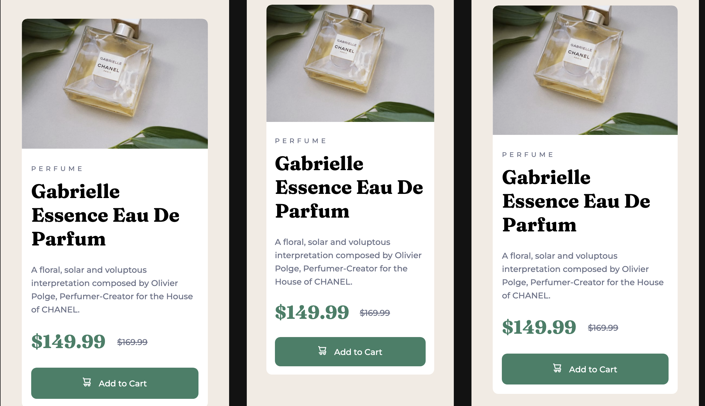
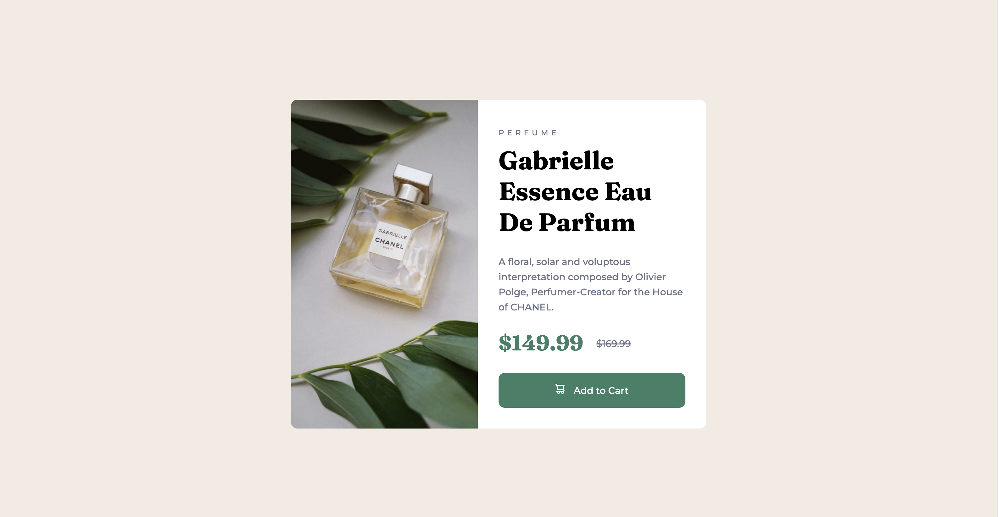

# Frontend Mentor - Product preview card component solution

This is a solution to the [Product preview card component challenge on Frontend Mentor](https://www.frontendmentor.io/challenges/product-preview-card-component-GO7UmttRfa). Frontend Mentor challenges help you improve your coding skills by building realistic projects. 

## Table of contents

- [Overview](#overview)
  - [Screenshots](#screenshots)
  - [Links](#links)
  - [Built with](#built-with)
  - [What I learned](#what-i-learned)
  - [Continued development](#continued-development)
  - [Useful resources](#useful-resources)
- [Author](#author)
- [Acknowledgments](#acknowledgments)

## Overview

### The challenge

Users should be able to:

- View the optimal layout depending on their device's screen size
- See hover and focus states for interactive elements

### Screenshots

Mobile Screenshot


Desktop Screenshot


### Links

- [Solution URL](https://github.com/EtFX1/Frontend-Mentor-Challenge-Product-preview-card-component)
- [Live Site URL](https://etfx1.github.io/Frontend-Mentor-Challenge-Product-preview-card-component/)

## My process

### Built with

- Semantic HTML5 markup
- CSS custom properties
- CSS Flexbox

### What I learned

I learned how to build containers just like in my first [Fontend Mentor Project](https://github.com/EtFX1/Frontend-Mentor-challenge-QR-code-component). I also learned how to use CSS flexbox to make components responsive. 

This media query was the secret to making this website responsive. And will flexbox, its really easy and convinient. 

```css
/* ?media query to change card to a horizontal card above 700px */
@media (min-width: 700px) {
  .card {
    display: flex;
    flex-direction: row;
    /* ? width of card in pixels so that the size doesn't change going upward */
    width: 41.25rem;
  }

  h1 {
    font-size: 2.5rem;
  }

  img {
    border-radius: 0;
    width: 48%;
    object-fit: cover;
  }
}
```


### Continued development

I want to continue to get comfortable with building out layouts in CSS flexbox and eventually CSS grid. So even if I choose to use a framework like Bootstrap in the future, I'll understand it a lot better. Also i can't wait for CSS container queries to be supported in all browsers. They'll replace media queries for sure. 


### Useful resources

- [The Ultimate CSS3 Flexbox Tutorial - Colt's Code Camp](https://www.youtube.com/watch?v=qZv-rNx0jEA) - This helped me to understand the basics of Flexbox. It's long, but it will break it down so well that it's worth the time!
- [Learn CSS Basics by Building a Card Component](https://www.freecodecamp.org/news/learn-css-basics-by-building-a-card-component/) - This is an amazing article which helped me understand how cards are built in CSS, and it teaches CSS basics while you're at it!
- [The OG Flexbox article](https://css-tricks.com/snippets/css/a-guide-to-flexbox/) -  Look nowhere else if you want a simple and clear understanding of CSS flexbox. It will demystify anything that has to do with FlexBox


## Author

- Frontend Mentor - [@ETFX1](https://www.frontendmentor.io/profile/yourusername](https://www.frontendmentor.io/profile/EtFX1)
- - GitHub - [@EtFX1](https://github.com/EtFX1)

## Acknowledgments

My acknowledgements go to the people who created the content mentioned in [Useful resources](#useful-resources)

